title: Unsupervised Video Summarization with Adversarial LSTM
tags:
  - 视频摘要
categories:
  - AI
author: Zhiyuan
date: 2019-09-21 19:23:00
---
&emsp;&emsp;本文提出一个由summarizer和discriminator组成的生成对抗框架。目的是选择视频的稀疏子集，使得视频和摘要的表示误差最小。

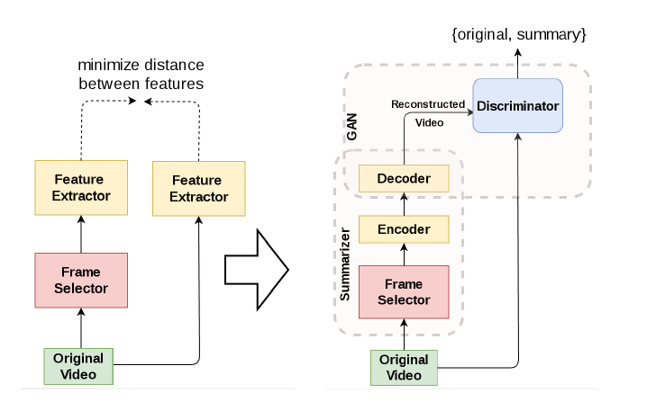

&emsp;&emsp;原始视频的特征是通过GAN和LSTM提取的，GAN以像素为基础提取特征，LSTM捕捉帧之间的长期依赖关系，得到深度特征向量。由于明确深度特征间的合适距离困难，所以由左边结构转换为右边的结构。

论文理论基础：Variational Autoencoder(VAE)，GAN

## Model Overview

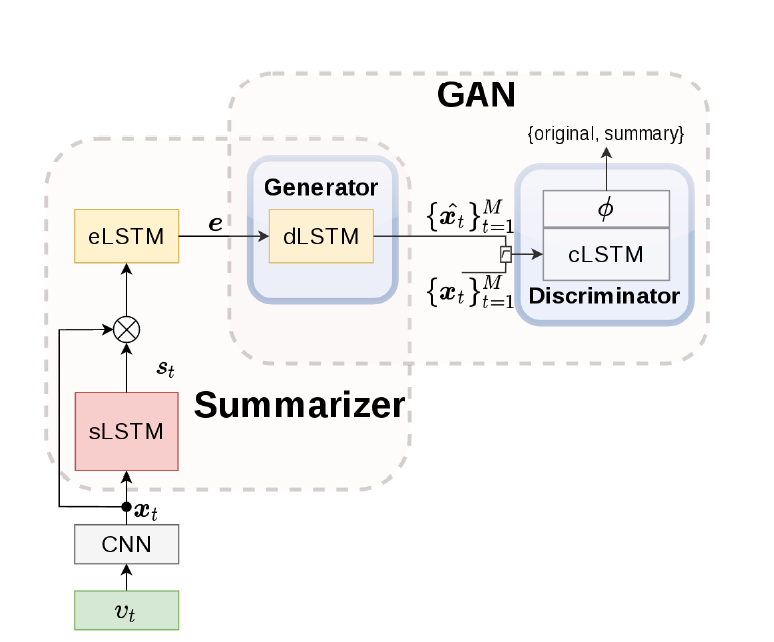
&emsp;&emsp;CNN输出的是视频帧的深度特征（deep features x），sLSTM（selector LSTM）在这些帧中选择一个子集，eLSTM(encoder LSTM)将选择的帧序列编码成向量 e 。sLSTM生成每一个帧的标准化重要性得分s，结合x，输入到eLSTM中。dLSTM(decoder LSTM)以e为输入，重构了输入视频的特征序列。鉴别器（discriminator）用来区分原始和摘要视频帧间的特征，用于估计两者之间的representation error。

&emsp;&emsp;本实验中使用二元序列分类器（a binary sequence classifier），所以鉴别器为cLSTM(classifier LSTM)，输出是二分类。

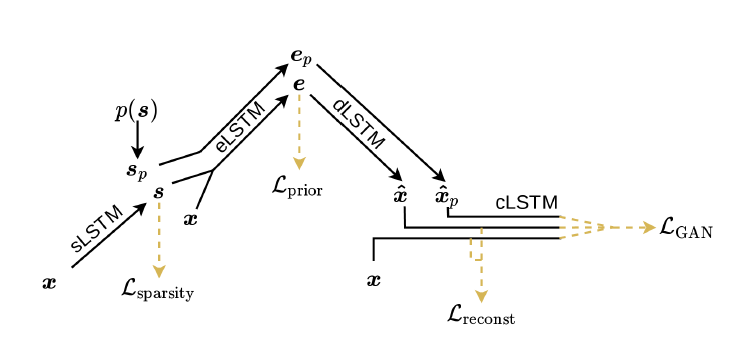

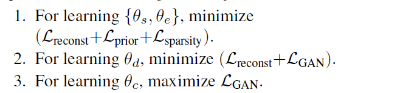

&emsp;&emsp;生成对抗训练的关键是引入一个额外的帧选择器Sp（基于先验分布的，例如均匀分布）。利用概率Sp选择一个子集作为eLSTM的输入，以相同的pipeline生成一系列值，用于计算误差。

### Reconstruction loss Lreconst

&emsp;&emsp;没有采用传统的欧式距离，而是基于cLSTM的隐藏层表示。cLSTM最后一个隐藏层的输出\*\*表示一个紧凑的特征向量，它捕捉了x（特征序列）的长距离依赖关系。Lre是对数似然的期望。

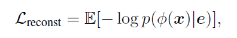

### Loss of GAN

这里的先验分布使用均匀分布。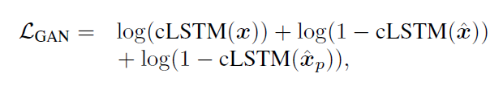

&emsp;&emsp;cLSTM(·)是一个二元的softmax输出。更新参数使用随机梯度变分bayes估计（Stochastic Gradient Variational Bayes estimation）

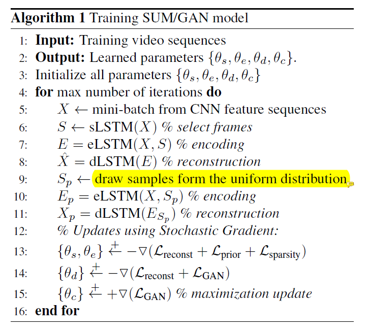

### 正则化训练

#### Summary-Length Regularization

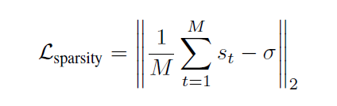

M帧数量，\*希望选择帧数量的百分比

#### Diversity Regularization

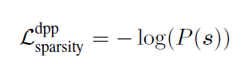

基于DPP

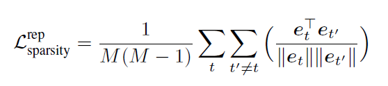

排斥正则化器（Repelling regularizer）

#### Keyframe Regularization

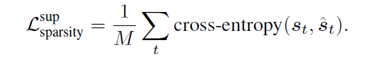