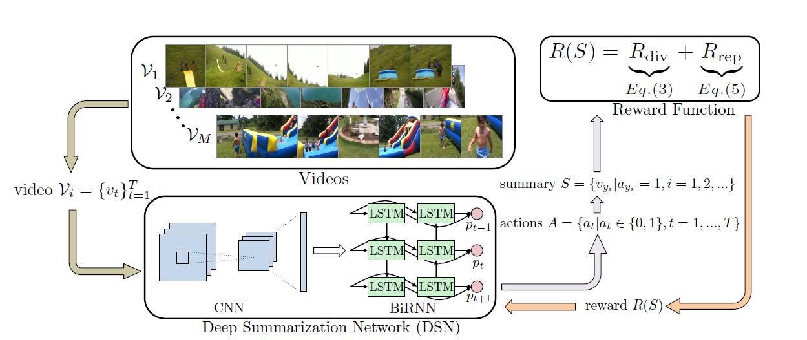
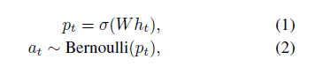
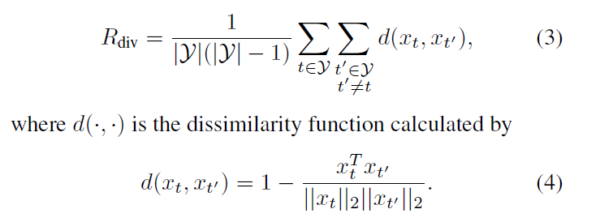
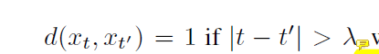
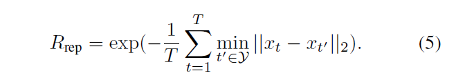

title: 'Deep Reinforcement Learning for Unsupervised V-S '
author: Zhiyuan
tags:
  - 视频摘要
categories:
  - AI
date: 2019-09-15 11:37:00
---
## Abstract

&emsp;&emsp;本文创新点：1、构建DSN网络；2、设计一个新的奖励函数（基于帧的多样性和代表性）；3、设计一个端到端的、基于强化学习的框架来训练网络。

## Introduction

&emsp;&emsp;DPP-LSTM效果较好，但是视频摘要的评价时，人类具有更多的主观性，所以非监督方法很有必要。  
&emsp;&emsp;本文的DSN网络：encoder：CNN（在视频帧上进行特征提取）；decoder：BiLSTM（产生概率分布来选择帧）。RL（增强学习）：通过迭代方式训练agent。  
&emsp;&emsp;主要贡献：将无监督方法扩展到监督版本，以利用标签；首次将RL应用到无监督视频摘要上。

## Model Overview

### Deep Summarization Network

&emsp;&emsp;采用encoder-decoder结构，CNN选用在ImageNet上预训练好的GoogLeNet，从它倒数第二层提取出视觉特征向量x_{t}。LSTM用来捕获视频帧之间的长时间依赖性。训练中只更新decoder。  

&emsp;&emsp;将BiLSTM网络的正向和反向的隐藏层输出拼接作为相应的隐状态，网络输入为视觉特征向量。全连接层结束于sigmoid函数，得出每个帧选择的概率分布，帧是否选择服从二项分布。视频摘要由这些选择的帧组成。

### Diversity-Representativeness Reward Function

&emsp;&emsp;训练时DSN的目的是最大化奖励函数。  
&emsp;&emsp;Diversity reward:通过计算选择帧之间的差异性（取平均值）来度量多样性，

&emsp;&emsp;公式3忽视了序列数据时间上的关联性，事实上，时间相距较大的两个相似帧对故事线的构筑都很重要。所以设置如下， 入控制时间距离。

&emsp;&emsp;Representativeness reward:视频摘要代表性的度量是一个k-medoids问题，

&emsp;&emsp;reward function使用这两个相加，训练时，保持这两个数量级一致。

### Training with Policy Gradient

&emsp;&emsp;这里介绍使用的强化学习的训练方法，和一些tricks。  
&emsp;&emsp;因为选择更多的帧也能提高reward，所以加入正则项。和防止过拟合的改进。  
&emsp;&emsp;这里给出更新参数的公式和最优化算法（Adam），详情见论文。

### Summary Generation

&emsp;&emsp;通过最大化得分选择子热点，同时控制帧数量不超过总长度15%。热点得分是通过平均化同一个热点中帧的得分来计算的。时间分割算法使用KTS。