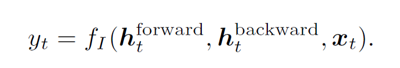

title: Video Summarization with LSTM
author: Zhiyuan
tags:
  - 视频摘要
categories:
  - AI
date: 2019-09-15 11:04:00
---
## Abstract

&emsp;&emsp;这篇文章提出一个新奇的监督学习方法用来进行视频摘要，用来自动选择关键帧或者关键子热点。将这项任务看成一个结构预测问题（structured prediction problem），主要思路是用LSTM对帧的时间依赖性进行建模。

## Introduction

&emsp;&emsp;视频摘要如今有两个重要的方法：关键帧选择（keyframe selection，选择一些具有代表性的帧来组成摘要）；关键子热点选择（Key subshot selection，选择一系列在短时间类连续的帧组成摘要，即选择视频中具有代表性的每个时间点，将这些时间点的帧选择）。  
&emsp;&emsp;非监督学习方法：通过直观标准选择帧  
&emsp;&emsp;监督学习方法：通过视频帧的标注训练模型，使模型自动学习选择帧的标准。  
&emsp;&emsp;模型输入是视频的帧序列，输出是一个二元数组（表示这些帧是否选择）。由此得到启发使用LSTM。视频帧内部的依赖性是复杂且不均匀的。  
&emsp;&emsp;使用LSTM从时间上建立帧的联系，比从视觉上建立联系好（比如不同帧的相似性）。时间上相近的帧，包含的信息会冗余且相似。但是相似的帧包含的信息并不一定相同，且时间不一定相近。使用LSTM来学习时间线。  
&emsp;&emsp;这篇文章研究如何将LSTM及其变体应用到Video Summarization中。将LSTM与DPP（determinantalpoint process）结合，等一些改进方法。

## Model Overview

**vsLSTM**网络结构：

**MLP**（多层感知机）：输出为标量

使用SGD更新参数，这里是监督学习的方法，使用帧级别重要性得分（连续变量）或者选择的关键帧编码（二元向量）

由于LSTM（查全率高，查准率低），DPP（查准率高，查全率低），现在将这两个结合，

**DPP**（行列式点过程）：DPP编码了从全集中选取任意一个子集的概率

z是子集,Z为全集，L为N\*N的核矩阵（记录任意连个帧之间的相似性，实对称**半正定**方阵），det()为行列式的值，I是N\*N的单位矩阵，子集z的概率与矩阵Lz的主子式行列式的值成正比。如果子集中有两个相同的元素时，det(Lz)将等于0。Lz是z在Z中标号对应元素组成的子方阵。

关于DDP的数学证明：https://blog.csdn.net/qq_23947237/article/details/90698325

**dppLSTM**：

MLP是由256个sigmoid隐单元、sigmoid和线性输出单元组成的单层神经网络，两个MLP（第一个计算frame-level importance,第二个计算相似性）

**Learning**：

参数的学习使用MLE（最大似然估计），采用阶段化优化策略：首先训练MLP1和LSTM（vsLSTM）；接下来通过最大化dpp模型指定关键帧的可能性来训练所有mlp和lstm层。

具体细节见论文及增刊